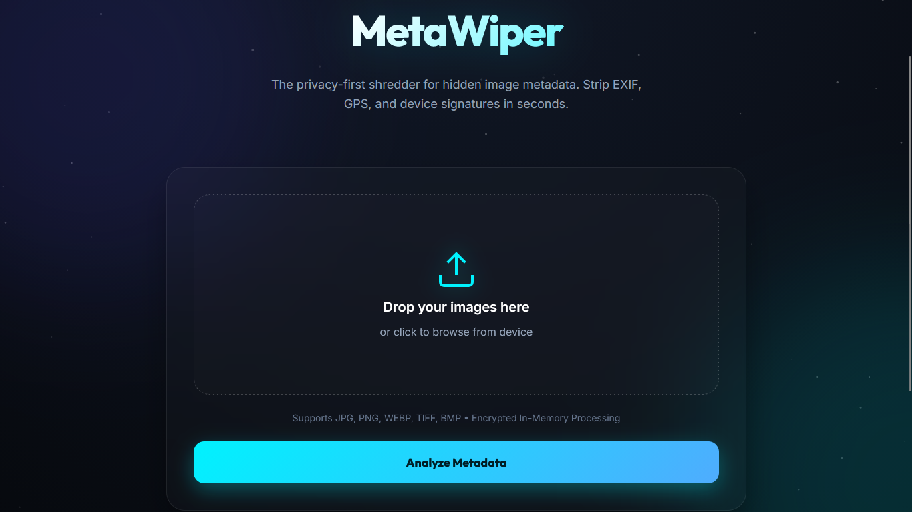

# MetaWiper • Privacy-First Image Metadata Cleaner

[](https://www.python.org/)
[](https://flask.palletsprojects.com/)
[](https://sonajit.in)
[](LICENSE)

MetaWiper is a modern, high-end web application designed to view and shred hidden EXIF metadata from your images. It focuses on absolute privacy, performing all operations in-memory without ever storing your files on a server.

---

## � Preview



---

## ✨ Features

- 💎 **Modern Glassmorphism UI** – A premium, high-end design with blurred surfaces and smooth micro-interactions.
- 🖼️ **EXIF Viewer** – Deep extraction of camera models, software versions, and technical apertures.
- � **GPS Detection** – Automatic mapping of location data to clickable Google Maps links.
- 🧹 **Instant Shredder** – One-click metadata removal using `piexif` for clean, shareable images.
- 🔐 **Privacy-First** – No databases, no file storage, and no logs. Processing happens in-memory and is discarded instantly.
- ⚡ **Multi-File Support** – Batch select files and manage them with an intuitive preview grid.
- 📱 **Fully Responsive** – Optimized for seamless use on both desktop and mobile devices.

---

## � Live Demo

🌐 [metawiper.sonajit.in](https://metawiper.sonajit.in)

---

## 🧰 Installation

### ⚙️ Quick Start (Local)

1. **Clone the repository:**
   ```bash
   git clone https://github.com/yourusername/metawiper.git
   cd metawiper
   ```

2. **Set up virtual environment (optional but recommended):**
   ```bash
   python -m venv .venv
   source .venv/bin/activate  # On Windows: .venv\Scripts\activate
   ```

3. **Install dependencies:**
   ```bash
   pip install -r requirements.txt
   ```

4. **Run the server:**
   ```bash
   python app.py
   ```
   Now open `http://localhost:5000` in your browser.

---

## 📁 Project Structure

```text
metawiper/
├── app.py                # Flask Backend & Routes
├── utils/
│   └── metadata_tools.py # EXIF extraction & stripping logic
├── static/
│   ├── style.css         # Modern Glassmorphism Design System
│   ├── ui.js             # Interaction logic & Micro-animations
│   └── particles.js      # Background particle engine
├── templates/
│   └── index.html        # Main Application Surface
├── assests/              # Images & Previews
├── requirements.txt      # Project dependencies
└── Procfile              # Render.com Deployment Configuration
```

---

## ⚒️ Tech Stack

- **Backend:** 🐍 [Flask](https://flask.palletsprojects.com/) (Python)
- **Processing:** 🖼️ [Pillow](https://python-pillow.org/) & [piexif](https://pypi.org/project/piexif/)
- **Frontend:** 🌐 Vanilla HTML5, Modern CSS (Glassmorphism), Vanilla JavaScript
- **Deployment:** 🚀 Render.com with Gunicorn

---

## 📜 License

This project is licensed under the **MIT License**. You are free to use, modify, and distribute this software for personal or commercial use.

---

## 👤 Managed By

Developed and Maintained by the team at **[sonajit.in](https://sonajit.in)**.

[](https://github.com/rootsecops0x1)
[](https://www.linkedin.com/in/sonajit0x1/)

---

> ❗ **Privacy Disclaimer**: MetaWiper does not store, log, or transmit your images to any third party. All processing is transient and in-memory.
